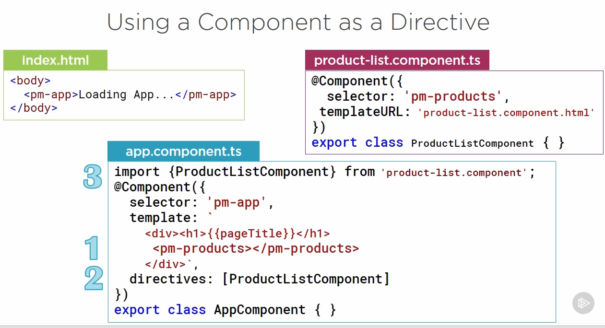

<!-- TOC insertAnchor:true orderedList:true -->

1. [Angular 2](#angular-2)
    1. [1. use Typescript: strongly typed](#1-use-typescript-strongly-typed)
    2. [2. npm (Node package manager)](#2-npm-node-package-manager)
        1. [AngularCli is a boilerplate for angular](#angularcli-is-a-boilerplate-for-angular)
    3. [3. module is namespace, to organize code](#3-module-is-namespace-to-organize-code)
    4. [4. component is a template (for view) + metadata using Decorator](#4-component-is-a-template-for-view-metadata-using-decorator)
    5. [5. Template](#5-template)

<!-- /TOC -->

# Angular 2

## 1. use Typescript: strongly typed 
        Typescript type definition files (*.d.ts)
        And using object !

## 2. npm (Node package manager)

### AngularCli is a boilerplate for angular 

## 3. module is namespace, to organize code 
   how to use? ES 2015 
    1. create code file: product.ts
            export class Product { //
                
            }
    2. and another file: product-list.ts
            import { Product } from
            '.product'

## 4. component is a template (for view) + metadata using Decorator
    Decorator is a function that adds metadata to a class, its members, or its method arguments
    prefixed with an @
    Comment: this decorator @Component is right above the export class like attribute in c#
    we have view layout, binding and directive name used in html
    Component = Template + Class + Metadaa

Here is the example:

    

## 5. Template

define a template

filter

product page

a component with directive

        