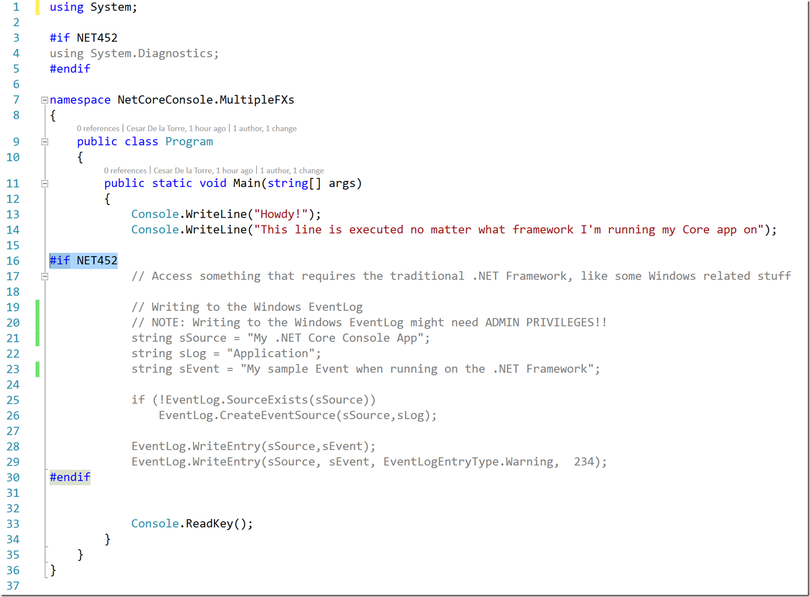
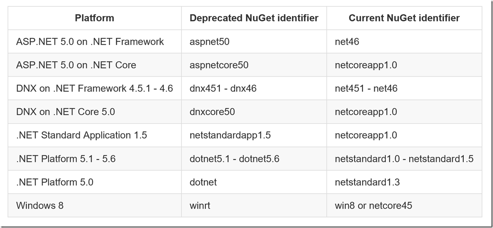

<!-- TOC insertAnchor:true orderedList:true -->

1. [Intellisense](#intellisense)
2. [many projects in 1 vscode](#many-projects-in-1-vscode)
3. [Running .net on multiple framework](#running-net-on-multiple-framework)
4. [packages like Quartz, Newtonsoft.Json](#packages-like-quartz-newtonsoftjson)
5. [support target frameworks:](#support-target-frameworks)
6. [remember to remove using and it will add the dependency later](#remember-to-remove-using-and-it-will-add-the-dependency-later)
7. [sample of multiple framework project.json](#sample-of-multiple-framework-projectjson)

<!-- /TOC -->

## Intellisense
at the right corner, select which ative project with project.json file

## many projects in 1 vscode 
from this //www.codeproject.com/Articles/1110660/How-To-Open-Build-Debug-Multiple-Projects-in-VS-Co

Now, it's time to add the main task runner, task.json file, press Command(Ctrl)+Shift+P and type Configure Task Runner and press enter, then choose .NET Core. A task .json file will be added for you , change it to something like this : 

task.json

{
    "version": "0.1.0",
    "command": "dotnet",
    "isShellCommand": true,
    "args": [],
    "tasks": [
        {
            "taskName": "build_task",
            "suppressTaskName": true,
            "args": [
                "build",
                "SecondProgram"
            ],
            "isBuildCommand": true,
            "showOutput": "silent",
            "problemMatcher": "$msCompile"
        } , 
        {
            "taskName": "restore"
        } 
    ]
}
project.json

{
  "version": "1.0.0-*",
  "buildOptions": {
    "debugType": "portable",
    "emitEntryPoint": true /* Set to false if you want a class library, or a project without entry point */
  },
  "dependencies": {},
  "frameworks": {
    "netcoreapp1.0": {
      "dependencies": {
        "Microsoft.NETCore.App": {
          "type": "platform",
          "version": "1.0.0"
        },
        "FirstLibrary": "1.0.0"
      },
      "imports": "dnxcore50"
    }
  }
}

## Running .net on multiple framework
from
https://blogs.msdn.microsoft.com/cesardelatorre/2016/06/28/running-net-core-apps-on-multiple-frameworks-and-what-the-target-framework-monikers-tfms-are-about/

## packages like Quartz, Newtonsoft.Json
those packages can put into project.json and it will be restored

## support target frameworks:
from https://docs.nuget.org/ndocs/schema/target-frameworks

## remember to remove using and it will add the dependency later

## sample of multiple framework project.json
from https://gist.github.com/CESARDELATORRE/9d6a236f28056fa7bcd7c12c45deae22

    {
    "dependencies": {
        "Microsoft.AspNetCore.Mvc": "1.0.0",
        "Microsoft.AspNetCore.Server.IISIntegration": "1.0.0",
        "Microsoft.AspNetCore.Server.Kestrel": "1.0.0",
        "Microsoft.Extensions.Configuration.EnvironmentVariables": "1.0.0",
        "Microsoft.Extensions.Configuration.FileExtensions": "1.0.0",
        "Microsoft.Extensions.Configuration.Json": "1.0.0",
        "Microsoft.Extensions.Logging": "1.0.0",
        "Microsoft.Extensions.Logging.Console": "1.0.0",
        "Microsoft.Extensions.Logging.Debug": "1.0.0",
        "Microsoft.Extensions.Options.ConfigurationExtensions": "1.0.0"
    },

    "tools": {
        "Microsoft.AspNetCore.Server.IISIntegration.Tools": "1.0.0-preview2-final"
    },

    "frameworks": {
        "netcoreapp1.0": {
        "imports": [
            "dotnet5.6",
            "portable-net45+win8"
        ],
        "dependencies": {
            "Microsoft.NETCore.App": {
            "type": "platform",
            "version": "1.0.0"
            }
        }
        },
        "net452": {
        }
    },

    "buildOptions": {
        "emitEntryPoint": true,
        "preserveCompilationContext": true
    },

    "runtimeOptions": {
        "configProperties": {
        "System.GC.Server": true
        }
    },

    "publishOptions": {
        "include": [
        "wwwroot",
        "Views",
        "Areas/**/Views",
        "appsettings.json",
        "web.config"
        ]
    },

    "scripts": {
        "postpublish": [ "dotnet publish-iis --publish-folder %publish:OutputPath% --framework %publish:FullTargetFramework%" ]
    }
    }