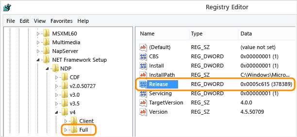

<!-- TOC insertAnchor:true orderedList:true -->

1. [current version of dotnet (regedit)](#current-version-of-dotnet-regedit)
2. [or cmd](#or-cmd)

<!-- /TOC -->

# current version of dotnet (regedit)
from https://msdn.microsoft.com/en-us/library/hh925568(v=vs.110).aspx

check HKEY_LOCAL_MACHINE\SOFTWARE\Microsoft\NET Framework Setup\NDP\v4\Full

# or cmd 
from http://stackoverflow.com/questions/1565434/how-to-find-the-net-version 